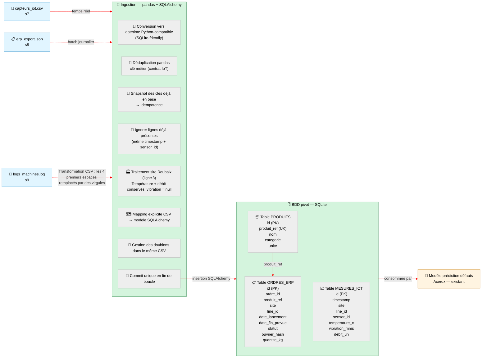
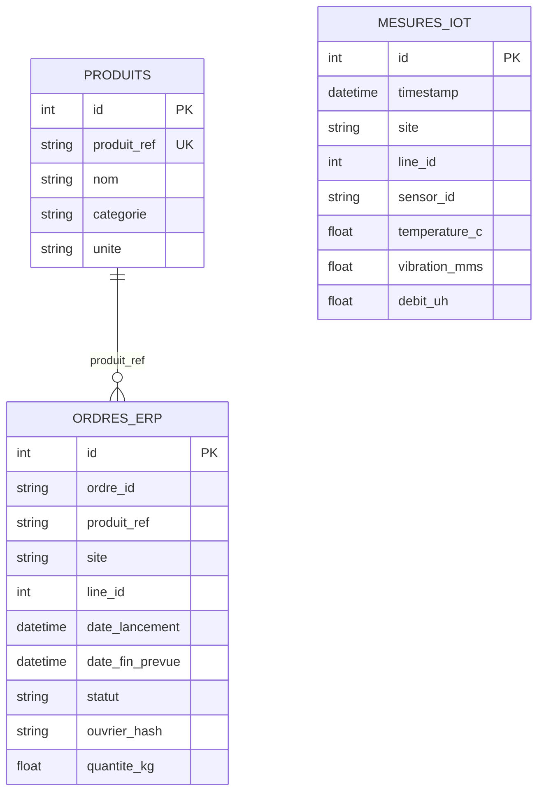

# M3-B2 — Pipeline Acerox (IoT + migrations)

> Repo binôme Théo & Romain.

Ce dépôt contient une pipeline d’ingestion pour les mesures IoT, un modèle SQLAlchemy, et une migration Alembic pour la table `mesures_iot`.

---

## Schéma des flux



---

## Démarrage rapide

```bash
git clone git@github.com:<owner>/M3-B2-acerox-<binome>.git
cd M3-B2-acerox-<binome>

python -m venv .venv
.\.venv\Scripts\Activate.ps1

pip install -r requirements.txt
alembic upgrade head
python -m src.pipeline_existante
```

Puis vérifier les tests :

```bash
pytest -q
```

---

## Reproduire le projet en 3 commandes

Si tu repars d’une base vide, ces 3 commandes suffisent pour remettre le projet en état de fonctionnement :

```bash
pip install -r requirements.txt
alembic upgrade head
python -m src.pipeline_existante
```

Ensuite, pour charger les mesures IoT :

```bash
python -m src.ingest_iot
```
Pour charger les ordres ERP :

```bash
python -m src.ingest_erp
```

---

## Régénérer la table `mesures_iot` et `ordres_erp`

Quand `src/models.py` change, il faut générer puis appliquer une migration Alembic.

### Cas standard: schéma modifié

```bash
alembic revision --autogenerate -m "add mesures_iot table"
alembic upgrade head
python -m src.ingest_iot
python -m src.ingest_erp
```

### Cas remise à plat complète

Si tu veux repartir de la version initiale puis reconstruire la base :

```bash
alembic downgrade 0001
alembic upgrade head
python -m src.ingest_iot
python -m src.ingest_erp
```

---

## Schéma Mermaid



Note: la table `mesures_iot` est indépendante de `produits` dans le code actuel. Le diagramme montre surtout les deux entités du projet.
La table `ordres_erp` est liée à `produits` via `produit_ref` : chaque ordre ERP référence un produit du référentiel Acerox.

---

## Rollback

### Revenir en arrière d’une migration

```bash
alembic downgrade -1
```

### Revenir à la base mesure_iot

```bash
alembic downgrade 0db6ffca86dc
```

### Revenir à la base initiale

```bash
alembic downgrade 0001
```

### Revenir ensuite au dernier état du projet

```bash
alembic upgrade head
```

### Versionning des migrations

```bash
alembic history
```

Si la base locale est incohérente, tu peux aussi supprimer `data/acerox.db` puis relancer :

```bash
alembic upgrade head
python -m src.pipeline_existante
```

---

## 📁 Structure du repo

```
M3-B2-acerox-<binome>/
├── data/
│   ├── produits.csv                  # référentiel initial Acerox
│   ├── capteurs_iot.csv              # source IoT ingérée
│   ├── erp_export.json               # source ERP ingérée
│   └── acerox.db                     # BDD SQLite locale
├── src/
│   ├── __init__.py
│   ├── db.py                         # engine + session SQLAlchemy
│   ├── models.py                     # Produit + MesuresIoT + OrdresErp
│   ├── pipeline_existante.py         # pipeline produit initiale
│   ├── ingest_iot.py                 # ingestion idempotente des mesures IoT
│   └── ingest_erp.py                 # ingestion des ordres ERP
├── alembic/
│   ├── env.py
│   ├── script.py.mako
│   └── versions/
│       ├── 0001_initial_schema.py                # table produits
│       ├── 0db6ffca86dc_add_mesures_iot_table.py # ajout de mesures_iot
│       └── c0251bc5f83c_add_ordres_erp_table.py  # ajout de ordres_erp
├── tests/
│   ├── __init__.py
│   ├── conftest.py                   # fixtures BDD éphémère
│   ├── fixtures/                     # jeux de données de test
│   ├── test_pipeline_initial.py      # non-régression pipeline initiale
│   ├── test_ingest_iot.py            # tests ingestion IoT
│   ├── test_ingest_erp.py            # tests ingestion ERP
│   └── test_migration.py             # tests de schéma et migrations
├── ressources/                       # docs d'appui + contrat de données
│   ├── README.md
│   ├── 01_SQLAlchemy_ORM_essentiel.md
│   ├── 02_Alembic_migration_essentiel.md
│   ├── 03_Ingestion_idempotente_essentiel.md
│   ├── 04_Tests_pipeline_essentiel.md
│   ├── 05_Pair_coding_git_essentiel.md
│   ├── contrat_donnees_modele.md
│   ├── fiche_modele_acerox.md
│   └── liens_officiels.md
├── decisions.md                      # décisions d'architecture et de conformité
├── alembic.ini
├── requirements.txt
├── .gitignore
└── README.md                         # documentation projet
```

---

## Conventions

- Python 3.11+
- Type hints sur les fonctions publiques
- `pathlib.Path` pour les chemins
- Pas de `print` en logique applicative
- Commit binôme avec `Co-authored-by: Prénom Nom <email>`

---

## Aide

- Modèle SQLAlchemy: [ressources/01_SQLAlchemy_ORM_essentiel.md](ressources/01_SQLAlchemy_ORM_essentiel.md)
- Alembic: [ressources/02_Alembic_migration_essentiel.md](ressources/02_Alembic_migration_essentiel.md)
- Ingestion idempotente: [ressources/03_Ingestion_idempotente_essentiel.md](ressources/03_Ingestion_idempotente_essentiel.md)
- Tests: [ressources/04_Tests_pipeline_essentiel.md](ressources/04_Tests_pipeline_essentiel.md)
- Git binome: [ressources/05_Pair_coding_git_essentiel.md](ressources/05_Pair_coding_git_essentiel.md)
